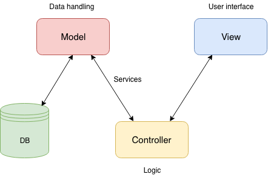
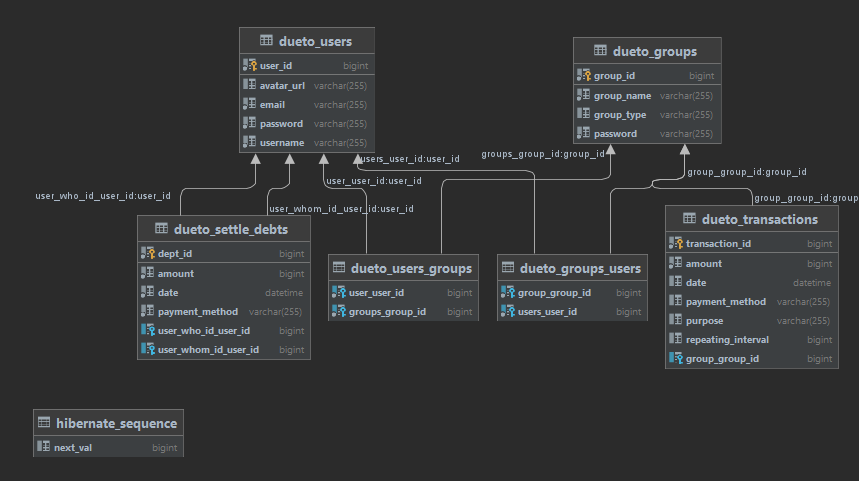

# Software Architecture Document

## Table of Contents

-   [Software Architecture Document](#software-architecture-document)

-   [Table of Contents](#table-of-contents)

    -   [1. Introduction](#1-introduction)

        -   [1.1 Purpose](#11-purpose)
        -   [1.2 Scope](#12-scope)
        -   [1.3 Definitions, Acronyms and Abbreviations](#13-definitions-acronyms-and-abbreviations)
        -   [1.4 References](#14-references)
        -   [1.5 Overview](#15-overview)

    -   [2. Architectural Representation and Patterns](#2-architectural-representation)

    -   [2.1 Technologies used](#21-technologies-used)

        -   [Spring Boot (Backend)](#spring-boot-backend)
        -   [ReactJS (Frontend)](#reactjs-frontend)

    -   [3. Architectural Goals and Constraints](#3-architectural-goals-and-constraints)

    -   [4. Use-Case View](#4-use-case-view)

        -   [4.1 Use-Case Realizations](#41-use-case-realizations)

    -   [5. Logical View](#5-logical-view)

        -   [5.1 Overview](#51-overview)

    -   [6. Process View](#6-process-view)

    -   [7. Deployment View](#7-deployment-view)

    -   [8. Implementation View](#8-implementation-view)

        -   [8.1 Overview](#81-overview)
        -   [8.2 Layers](#82-layers)

    -   [9. Data View](#9-data-view)

    -   [10. Size and Performance](#10-size-and-performance)

    -   [11. Quality/Metrics](#11-qualitymetrics)

## 1. Introduction

### 1.1 Purpose

This document provides a comprehensive architectural overview of the system, using a number of different architectural views to depict different aspects of the system. It is intended to capture and convey the significant architectural decisions which have been made on the system.

### 1.2 Scope

The scope of this SAD is to show the architecture of our DueTo project. Illustrated are the Use-Cases, the class and data structure.

### 1.3 Definitions, Acronyms and Abbreviations

| Abbrevation | Description                         |
| ----------- | ----------------------------------- |
| SRS         | Software Requirements Specification |
| UC          | Use Case                            |
| MVC         | Model View Controler                |

### 1.4 References

| Title                                                                                                                |    Date    | Publishing organization                    |
| -------------------------------------------------------------------------------------------------------------------- | :--------: | ------------------------------------------ |
| [DueTo Blog](https://sedueto.wordpress.com/)                                                 | 2021-12-07 | DueTo-Team                    |
| [Repository on GitHub](https://github.com/SE-DueTo/)                                                       | 2021-12-07 | DueTo-Team                    |
| [SRS](./SRS.md)                                                                                                      | 2021-12-07 | DueTo-Team                    |

### 1.5 Overview

This document contains the Architectural Representation, Goals and Constraints as well as the Logical, Deployment, Implementation and Data Views.

## 2. Architectural Representation and Patterns

We are trying to implement according to the MVC pattern:

## 2.1 Technologies used

tl;dr; Blogpost [here!](https://sedueto.wordpress.com/2021/10/12/week-1-2-technologies-and-roles/)

IDEs:

-   Frontend: Visual Studio Code
-   Backend: IntelliJ IDEA Ultimate 

Languages:

-   Frontend: JavaScript, HTML, CSS, JSON for data transfer
-   Backend: Java, hardly any SQL

Frameworks:

-   Frontend: ReactJS, MaterialUI
-   Backend: Springboot

Testing (part of CI / CD mentioned Travis pipeline):

-   Frontend: Selenium for running UI tests based on Gherkin / Cucumber .feature files
-   Backend: to be determined (tbd)
-   Coverage: to be determined (tbd)

Metrics & Patterns (part of CI / CD mentioned Travis pipeline):

-   to be determined (tbd)

Deployment (part of CI / CD mentioned Travis pipeline):

-   Docker

In detail:

### Spring Boot (Backend)

Spring Boot is built on top of the Java Spring framework and provides the developer with helpful features to create and run web applications. In our case, a REST Web Service
which represents the interface between our front- and backend. As we want to benefit from the newest features of Java 10, the platform this service will be hosted on needs to support Java 10 or higher.

We use InteliJ IDEA Ultimate for coding in the backend. The backend will be written with pure Java. Only to fill our database with testable content we use one file SQL.

### ReactJS (Frontend)

ReactJS helps building interactive UIs that can be updated dynamically and therefore eliminate the need to refresh the web application. One can also develop single
components and can reuse them all over the application. Such a component could be a login form, a profile card or anything else one wants to reuse. We are going to
import a React framework called Material-UI that provides a lot of pre-defined components. Its design based on the Material-Design of Google. The development will
take place with the newest version of JavaScript. Fortunately, our development environment is able to compile it to the lower version of JavaScript. Thus, we can
use the newest features without having to worry about browser compatibility.

We use Visual Studio Code for coding in the frontend. To display we use HTML and CSS and for functionality we use JavaScript.

## 3. Architectural Goals and Constraints

We decided to use Spring MVC as our main framework. It allows us to unite backend, frontend development and the database integration in one code base.

## 4. Use-Case View

Our Use-Case-Diagram

### 4.1 Use-Case Realizations

-   to be determined (tbd)

## 5. Logical View

MVC high level diagram

Marked MVC class diagram

## 6. Process View

-   to be determined (tbd)

## 7. Deployment View

### 7.1 Deployment Process

Because Google Drive is weird: [Link](https://drive.google.com/file/d/1ONnJIUAL-fyRoChHP6SaufGdWcy37V09/view?usp=sharing)

### 7.2 Deployment View

Our Service are hosted on the Microsoft Azure plaform and consists of two Azure Service Plans:

- Azure App Service
- Azure MySQL Service

The hardware configuration is not known to us, as it scales automatically by its needed performance.

## 8. Implementation View

-   to be determined (tbd)

### 8.1 Overview

-   to be determined (tbd)

### 8.2 Layers

-   to be determined (tbd)

## 9. Data View

The following graphic describes the relationship model of the in use database

Relationship Model

Real world Model

Class Diagram

## 10. Size and Performance

-   to be determined (tbd)

## 11. Quality/Metrics

to be determined (tbd)
